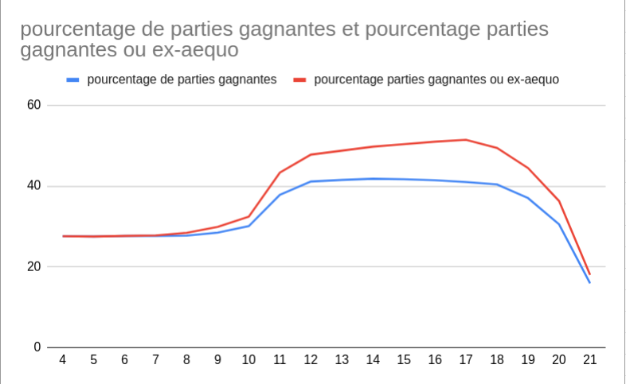

# BlackJack
Après avoir découvert les jeux du casino, mon esprit est resté bloqué sur le jeu du BlackJack (et ce qu'il y avait dans mon porte monnaie aussi...).  
Comme ce jeu m'intriguait, j'ai fini par me poser des questions. 
- Pourquoi leur IA s'arrête de piocher à partir de 17 points ?
- Quel est la meilleur stratégie à suivre pour maximiser ses chances de gagner ?
Dans un premier temps, j'ai codée le jeu.
Dans un deuxième temps, j'ai pu établir le pourquoi 17 points ? 
Mais ça me paraissait trop naif comme possibilité  

On sait que le croupier pioche une carte avant même que nous recevions les deux notres.
Mais alors est-il possible de faire varier sa stratégie suivant la valeur qu'il tire ?
Par exemple, s'il pioche une carte en dessous ou égale à 5, il sera obligé de piocher deux autres cartes car le maximum qu'il peut tirer est 11 (un As) et 5 + 11 = 16 qui est inferieur à 17.
En revanche, s'il tire une carte supérieur ou égale à 6, il peut gagner seulement avec une seule carte de plus.
## Etape 1 : Le jeu

### Règle du jeu : 

#### But du jeu

Après avoir reçu deux cartes, le joueur tire des cartes pour s’approcher de la valeur 21 sans la   dépasser. Le but du joueur est de battre le croupier en obtenant un total de points supérieur à   celui-ci ou en voyant ce dernier dépasser 21. Chaque joueur joue contre le croupier, qui représente  
la banque, ou le casino, et non contre les autres joueurs.

#### Valeurs des cartes au blackjack

Chaque carte numérotée de 2 à 10 a sa valeur nominale (égale au numéro sur la carte)  
Les valets, les dames et les rois (les figures), ont une valeur de 10 points  
L’As vaut 1 point ou 11 points, au choix du joueur  


Pour plus de détail : https://www.guide-blackjack.com/regles-du-black-jack.html


## Etape 2 : La recherche

### 2.1 Partie naive : 
Pour cette partie, j'ai codée une méthode qui permet de jouer un tour de manière naif, (i.e. le bot ne s'arrête que quand la somme des cartes dépasse ou est égale à la valeur donnée).

Grâce à ça, j'ai pu établir une moyenne du pourcentage de victoire et de défaite sur 1 000 000 de partie.

J'ai ensuite rempli un tableau avec ces valeurs et de là, est sorti ce graphique : 


On peut voir que la probabilité d'avoir une partie gagnante ou ex-aequo est la plus élevée lorsqu'on arrête de tirer quand la somme de nos cartes est au moins de 17.  
Cela appuie le fait que dans les casinos les IA qui servent de croupier s'arrêtent de tirer dès qu'elles ont un total de 17 points au moins.

### 2.2 Partie complète : 
Dans cette partie, on prend en compte la première carte piochée par le croupier et on teste quelle est la meilleur stratégie.
Après avoir codée 2 méthodes permettant de tester la probabilité, en est sorti le fichier ***etudePremiereCarteConnue.pdf***
Dans ce tableau, ce qui saute d'abord aux yeux est que si la première carte piochées par le croupier est supérieur ou égale à 7, il est plus probable de gagner ou d'égaliser si on pioche au moins 17 points.  
En revanche, dans les cas inférieurs, il est plus intéressant de ne piocher que de manière à avoir au moins 13 points.

On peut donc supposer que la "meilleur" stratégie est plutôt celle de piocher 14 points si la carte piochée par le croupier est inférieur à 7 et de piocher au moins 17 points autrement.


## Etape 3 : La partie graphique
Je développerai peut-être cette partie plus tard, elle n'était pas le coeur de l'interrogation

# Installation : 
#### Jouer depuis un terminal : 
```bash
git clone git@github.com:Ne0re0/BlackJack.git
cd BlackJack
python blackjack.py
```